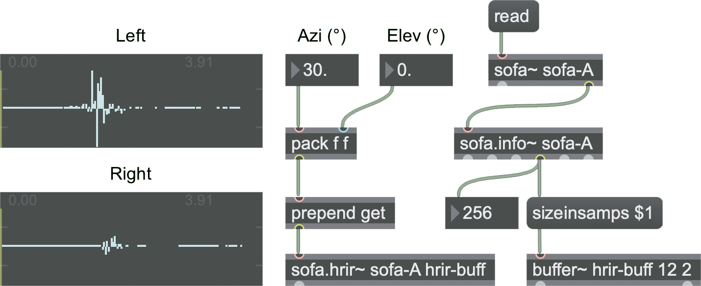

# SOFA for Max

An object collection for using and creating Spatially Oriented Format for Acoustics (SOFA) files within Cycling 74's Max software. This file format enables the distribution of impulse response measurement data in a standardised fashion. More information of this file format can be found [here](https://www.sofaconventions.org/mediawiki/index.php/SOFA_(Spatially_Oriented_Format_for_Acoustics)).

By Dale Johnson and Hyunkook Lee, Applied Psychoacoustics Laboratory, The University of Huddersfield.

https://www.hud.ac.uk/apl/resources

## TODO

* Add sofa.poke~
* Fix shared object functionality
* ~~Create help files~~ Done!
* ~~Compile and release a windows version~~ Done!

## Getting Started

You can either download a ready built version of the object collection from the releases [page](https://github.com/APL-Huddersfield/SOFA-for-Max/releases) and placed within your Max search path (e.g ./Max 7/Library/ ), or build this repository from source.

These instructions will get you a copy of the project up and running on your local machine for development and testing purposes. See deployment for notes on how to deploy the project on a live system.

### Warning

The shared sofa~ object functionality is currently disabled. Only one instance of a named sofa~ file may currently exist. This feature will be fixed in future releases.

### Compatibility

The current version of the code and its associated release is compatible with both macOS and Windows.

### Prerequisites

This project requires a build of the **[libsofa](https://github.com/sofacoustics/API_Cpp)** library to be placed in the 'libraries' directory of this project, or in your library search path of your development environment.

### Installing

This source code can be built using either Xcode or Visual Studio. The resulting objects can then be placed in a location within your Max search path e.g. ~/Documents/Max 7/Library/SOFA

Windows Users: You will need to place some extra DLL files in your Max install folder. These are in the "Dependencies" folder of the latest release. Depending on the bit-ness you use, these should be placed in either "C:\Program Files (x86)\Cycling '74\Max" for 32-bit Max, or "C:\Program Files\Cycling '74\Max" for 64-bit Max.

## License

This project is licensed under the BSD-3 License - see the [LICENSE.md](LICENSE.md) file for details

## Acknowledgments

Thanks to the original authors and creators behind SOFA, Piotr Majdak and Markus Noisternig, and to Thibaut Carpentier for the libsofa C++ API.

See also the list of [contributors](https://www.sofaconventions.org/mediawiki/index.php/People_behind_SOFA) who participated to SOFA.
